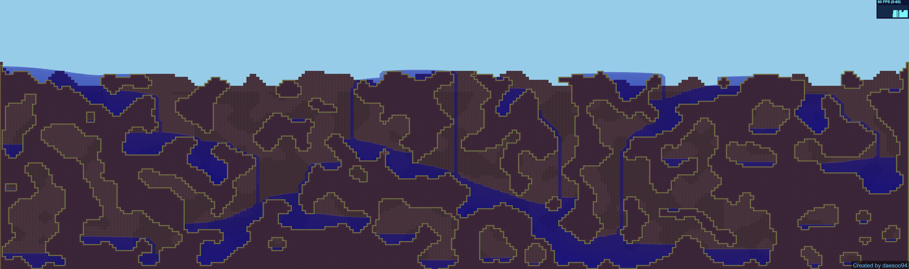

# Engine - 2d platform game engine
  
Open Source 2D Game Engine Using `typescript (javascript)`   
the goal of this project is to create **efficient engine for huge tile platform 2D game** like terraria.  

### Demos with pixi.js ###

- [Tilemap With buffer](https://simdaesoo.github.io/Engine/build/#/)
- [Cave Generate](https://simdaesoo.github.io/Engine/build/#/cave-generate)
- [Cave With Texture](https://simdaesoo.github.io/Engine/build/#/cave-generate-texture)
- [Cave With Sky](https://simdaesoo.github.io/Engine/build/#/cave-generate-sky)
- [Liquid Simulation](https://simdaesoo.github.io/Engine/build/#/liquid-simulation)
- [Liquid Simulation 2](https://simdaesoo.github.io/Engine/build/#/liquid-simulation-2)
- [Liquid Stress Test](https://simdaesoo.github.io/Engine/build/#/liquid-stress-test)
- [Line Intersection](https://simdaesoo.github.io/Engine/build/#/line-intersection)
- [Line Intersection 2](https://simdaesoo.github.io/Engine/build/#/line-intersection-2)
- Lighting Area
- Lighting Area 2
- Lighting Stress Test
- AABB Collision
- AABB Collision 2
- AABB Stress Test
- Sample World
- Others...